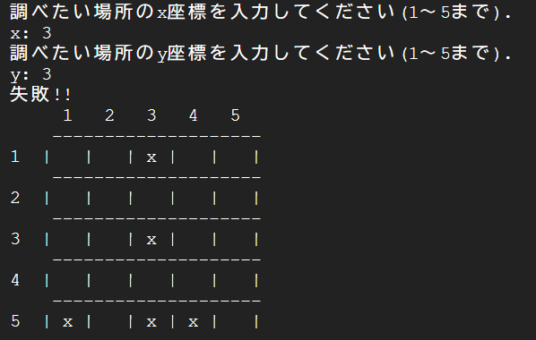
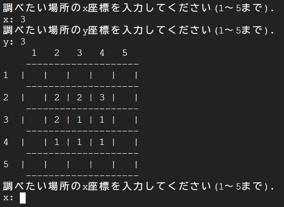

# Bomb-Game
#ゲーム概要<br>
ターミナル上で動く5*5サイズのフィールド上に存在する爆弾を予測しながら全て回避することを目指すゲームです。<br>

------------------------------------------------------------------------------------

#main
```
int main(void)
{
	int x, y;
	int check;
	int counter = 0;	

	Field_init();
	Show_field(NOW);
	
	while(1) {
		printf("調べたい場所のx座標を入力してください(1～%dまで).\nx: ", SIZE);
		scanf("%d", &x);
		printf("調べたい場所のy座標を入力してください(1～%dまで).\ny: ", SIZE);
		scanf("%d", &y);
		if( x > SIZE || x <= 0 || y > SIZE || y <= 0 ) {
			printf("xまたはyが範囲外の値です．正しい値を入力してください．\n");
			continue;
		}
		check = Bomb_counter(x-1, y-1);
		if( check == -1 ) {
			printf("Bomb!!\n");
			Show_field(ANS);
			break;
		}
		Show_field(NOW);
		counter += check;
		if( counter == SIZE * SIZE - BOMBS ){
			printf("CONGRATULATION!!!\n");
			break;
		}
	}
		

	return 0;
}
```

------------------------------------------------------------------------------------

#実際の利用画像<br>

ターミナル上でSystemを実行することで5*5マスのフィールドが表示されます。

<br>

選択したマスに爆弾が存在した場合、全ての爆弾の位置が表示され、ゲームが終了します。

<br>

選択したマスに爆弾が存在しない場合、選択したマスの周囲8マスに、それぞれの周囲に存在する爆弾の数が表示され、保存されます。

<br>

------------------------------------------------------------------------------------

#システム<br>
使用言語：Clang<br>
実行環境：Google Cloud Shell<br>
制作時間：1時間30分<br>


#免責事項<br>
本リポジトリのコードは参考用に提供しており、動作や結果について一切保証しません。<br>
本コードの使用によって生じたいかなる損害、データの破損、トラブル等についても、当方は一切責任を負いません。自己責任でご利用ください。
